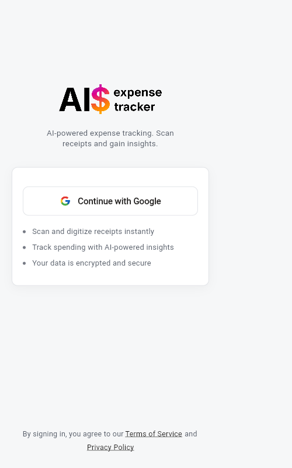
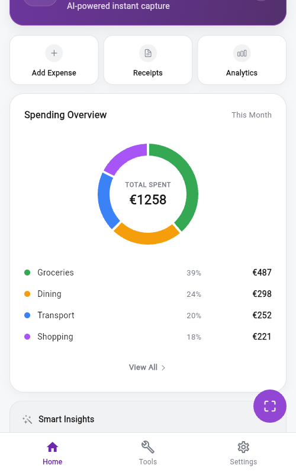
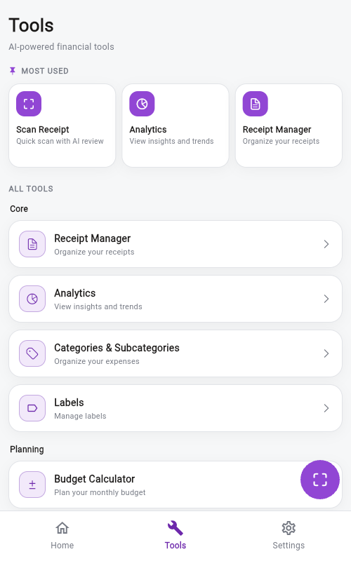
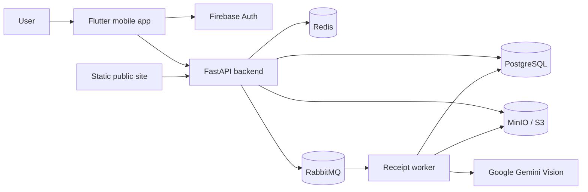
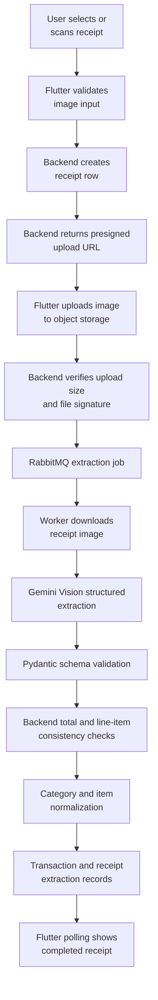

# AI Expense Tracker

AI Expense Tracker is a full-stack open-source application that turns receipt images
into structured expense records using a Flutter mobile client, a FastAPI
backend, an asynchronous worker, object storage, and a vision LLM pipeline.

The project combines applied AI engineering, backend architecture, mobile
product development, security boundaries, and production operations in one
coherent system.

## Problem Statement

Personal expense tracking usually fails because manual entry is tedious and
receipt data is messy. Receipts can contain inconsistent layouts, mixed
languages, discounts, tax lines, item-level totals, and unclear category
signals.

This project solves that workflow by letting a user upload or scan a receipt,
extracting structured data with AI, validating the result, classifying the
expense, and saving normalized transactions for review and analytics.

## Key Features

### Product

- Google/Firebase authentication.
- Receipt upload and scan flow from the Flutter app.
- Transaction, item, category, label, analytics, and planning screens.
- Subscription entitlement plumbing through RevenueCat.
- Account deletion and data export/import support.

### Backend

- FastAPI API with Pydantic/SQLModel validation.
- PostgreSQL persistence with Alembic migrations.
- Direct-to-object-storage receipt uploads through presigned URLs.
- RabbitMQ-backed asynchronous receipt processing.
- Redis-backed runtime support.
- User ownership checks and protected API routes.

### AI

- Mobile document scanning and image preparation before upload.
- Vision LLM receipt parsing through Google Gemini.
- Structured output into typed backend schemas.
- Merchant, date, currency, totals, tax, discount, and line-item extraction.
- Category classification against the application's taxonomy.
- Backend-computed validation warnings for mismatched totals.

### Operations

- Docker Compose for local development.
- Production-oriented Kubernetes manifests.
- Network policies, health checks, metrics, and backup/restore tooling.
- GitHub Actions for backend, Flutter, image, dependency, and secret checks.

## App Preview

<p align="center">
  
  
  
</p>

<p align="center"><em>Secure sign-in &rarr; Home overview &rarr; Financial toolkit</em></p>

## Architecture



## AI Pipeline



## Tech Stack

| Area | Technologies |
|---|---|
| Mobile | Flutter, Dart, Firebase Auth, Google Sign-In, ML Kit document scanner |
| Backend | Python, FastAPI, SQLModel, SQLAlchemy, Alembic, Pydantic |
| AI | Google Gemini Vision, LangChain structured output, optional LangSmith tracing |
| Data | PostgreSQL, Redis, MinIO/S3-compatible object storage |
| Messaging | RabbitMQ, aio-pika |
| Billing | RevenueCat webhooks and entitlement checks |
| Operations | Docker, Docker Compose, Kubernetes, Prometheus, Grafana |
| Quality | Pytest, Ruff, Flutter analyze/test, Gitleaks, Dependabot |

## Installation

### Prerequisites

- Docker and Docker Compose
- Python 3.11+
- `uv`
- Flutter stable
- Firebase project for real authentication
- Google AI API key for real receipt extraction

### Local Backend And Services

```bash
cp .env.example .env
docker compose up --build
```

The local public site runs on `http://localhost:3000`.
The backend API runs on `http://localhost:8000`.

Run migrations manually when needed:

```bash
docker exec -it fastapi uv run alembic upgrade head
```

### Backend Without Docker

```bash
cd backend
uv sync --frozen --all-groups
uv run alembic upgrade head
uv run uvicorn app.main:app --reload --host 0.0.0.0 --port 8000
```

### Flutter App

```bash
cd expense_tracker_app
flutter pub get
flutter run --dart-define=API_BASE_URL=http://10.0.2.2:8000
```

Use `10.0.2.2` for an Android emulator. For a physical phone, use your
development machine's LAN IP.

## Environment Variables

Copy `.env.example` to `.env` for local development. Never commit real `.env`
files or production secrets.

| Group | Important Variables | Notes |
|---|---|---|
| App | `APP_ENV`, `PUBLIC_API_BASE_URL`, `PUBLIC_APP_BASE_URL`, `TRUSTED_HOSTS`, `CORS_ALLOWED_ORIGINS` | Public URLs and runtime safety boundaries. |
| Database | `DATABASE_URL`, `POSTGRES_HOST`, `POSTGRES_USER`, `POSTGRES_PASSWORD` | Use generated passwords outside local development. |
| Queue/cache | `RABBITMQ_URL`, `RABBITMQ_USER`, `RABBITMQ_PASSWORD`, `REDIS_URL` | RabbitMQ handles async receipt extraction. |
| Storage | `S3_ENDPOINT`, `S3_EXTERNAL_ENDPOINT`, `S3_ACCESS_KEY`, `S3_SECRET_KEY`, `S3_BUCKET_RECEIPTS` | Presigned uploads and receipt retrieval. |
| Auth | `FIREBASE_SERVICE_ACCOUNT_PATH`, `FIREBASE_SERVICE_ACCOUNT_JSON_B64` | Server-side Firebase token verification. |
| AI | `GOOGLE_API_KEY`, `LLM_MODEL_NAME`, `ITEM_NORMALIZATION_ENABLED` | Required for real Gemini extraction. |
| Billing | `REVENUECAT_SECRET_API_KEY`, `REVENUECAT_WEBHOOK_AUTH_SECRET`, `REVENUECAT_*_ENTITLEMENT_ID` | Keep server keys secret. |
| Mobile build | `API_BASE_URL`, `REVENUECAT_ANDROID_API_KEY`, `APP_PRIVACY_URL`, `APP_TERMS_URL` | Passed with `--dart-define` for production builds. |

Full details are in [docs/ENVIRONMENT_VARIABLES.md](docs/ENVIRONMENT_VARIABLES.md).

## Deployment

### Docker

Build the backend image from the repository root:

```bash
docker build -f Dockerfile -t ai-expense-tracker-backend:local .
```

Build the public site:

```bash
docker build -f site/Dockerfile -t ai-expense-tracker-site:local .
```

For production Compose, combine the base and production override:

```bash
docker compose -f docker-compose.yaml -f docker-compose.prod.yaml up -d
```

### Kubernetes

Production manifests live under `infra/k8s`. The production overlay is rendered
from environment input and validated in CI:

```bash
uv run python infra/k8s/scripts/render_k8s_env.py \
  --env-file .env.production.example \
  --output-dir infra/k8s/overlays/production/generated

kubectl kustomize infra/k8s/overlays/production
```

See [docs/DEPLOYMENT.md](docs/DEPLOYMENT.md) and [docs/OPS_RUNBOOK.md](docs/OPS_RUNBOOK.md) for operational details.

## Testing

Backend:

```bash
cd backend
uv run ruff check .
uv run pytest -q
```

Flutter:

```bash
cd expense_tracker_app
flutter analyze
flutter test
```

Security:

```bash
gitleaks detect --source . --config .gitleaks.toml --redact --verbose
```

## Engineering Decisions

- Firebase Auth is used to avoid building custom credential storage and token
  lifecycle management.
- Receipt images are uploaded directly to object storage through presigned URLs
  so the API does not proxy large files.
- RabbitMQ separates user-facing upload latency from slower AI extraction.
- Gemini Vision is used for receipt OCR-like understanding and structured
  extraction from messy layouts.
- Backend validation computes deterministic warnings instead of trusting the LLM
  to identify all inconsistencies.
- S3-compatible storage keeps the system portable between local MinIO and cloud
  object stores.
- Kubernetes network policies and startup checks make production assumptions
  explicit.

More detail is available in [DESIGN.md](DESIGN.md).

## AI Evaluation

It defines anonymized receipt fixtures, expected structured outputs, entity
accuracy, numeric tolerances, classification metrics, and quality gates for
future prompt/model changes.

## Future Improvements

- Add an automated offline evaluation runner for anonymized receipt fixtures.
- Add provider abstraction for multiple vision LLMs.
- Add prompt version tracking and regression reports.
- Add more production hardening for multi-replica deployments.
- Split the largest API/mobile modules once behavior is stable.
- Add a public demo mode with synthetic data.

## Security And License

This project is released under the MIT license. See `LICENSE`.

Security reporting and secret-handling guidance are in `SECURITY.md`.
